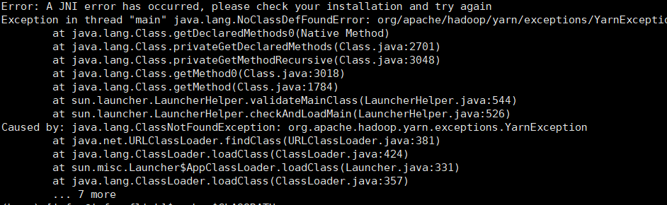
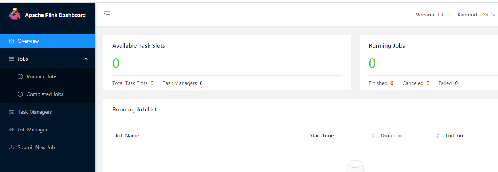
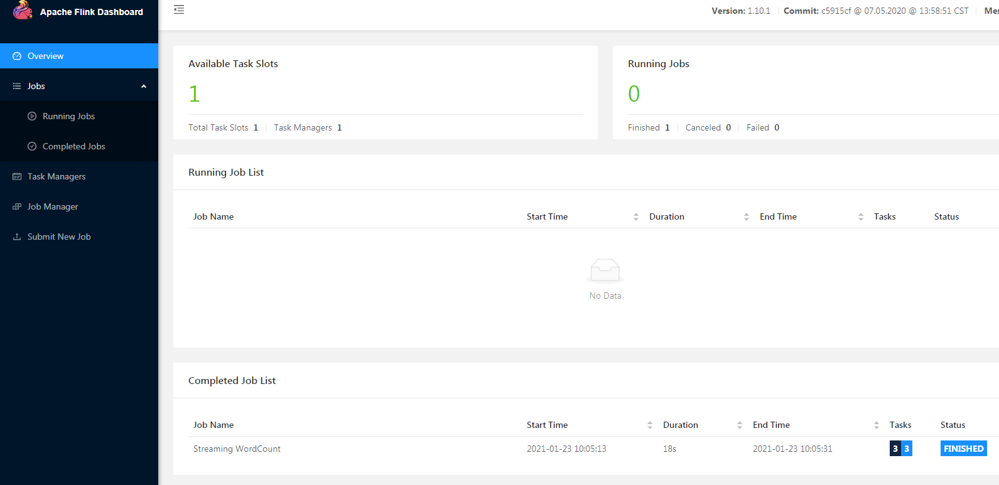

### 五、Flink on yarn部署


#### 一、软件版本

hadoop2.7.3

flink1.10.1


#### 二、部署步骤

##### 1.下载安装包

hadoop部署就不赘述了，我是在虚拟机部署的，就部署了两个节点。

flink下载地址：https://flink.apache.org/downloads.html或https://archive.apache.org/dist/flink/flink-1.10.1/

下载对应的版本flink-1.10.1-bin-scala_2.11.tgz即可。


##### 2.解压安装包到指定的机器

```shell
cd /home/master/software
tar -xvf flink-1.10.1-bin-scala_2.11.tgz
```


##### 3.修改配置

1.修改环境变量

```shell
vim ~/.bash_profile
添加HADOOP_HOME
export HADOOP_HOME=/home/master/software/hadoop-2.7.3
添加FLINK_HOME
export FLINK_HOME=/home/master/software/flink-1.10.1
export PATH=$JAVA_HOME/bin:$HADOOP_HOME/bin:$HADOOP_HOME/sbin:$PATH:$SPARK_HOME/bin:$FLINK_HOME/bin
```

2.修改masters文件

```shell
cd flink_home/conf
vim masters
修改为：
bigdata02:8081
bigdata02为当前主机名
```

3.添加jar文件到lib目录

将flink-shaded-hadoop-2-uber-2.7.5-10.0.jar放到flink_home/lib目录中

虽然这是2.7.5的hadoop版本，但是2.7.3也可以用

如果缺少这个jar会报错，如下：

<div align=center>
  
</div>


##### 4.在**Yarn** **上启动** **Long Running** **的** **Flink** **集群（**Session Cluster **模式）**

我这里内存资源比较少，所以分配的内存也比较少

```
./yarn-session.sh -n 1 -jm 1024 -tm 1538
```

这种方式客户端是一直作为一个单独的进程运行。YarnSessionClusterEntrypoint和FlinkYarnSessionCli两个进程存在。

如果要停止yarn-session集群直接把客户端关闭就可以了。


还有一种启动方式是启动yarn-session集群后客户端就直接退出，这种情况只有YarnSessionClusterEntrypoint进程。

```
./yarn-session.sh -d -n 1 -jm 1024 -tm 1538
```

如果要停止yarn-session集群需要通过yarn application kill命令关闭。


其中用到的参数是：

- -n,–container Number of TaskManagers
- -jm,–jobManagerMemory Memory for JobManager Container with optional unit (default: MB)
- -tm,–taskManagerMemory Memory per TaskManager Container with optional unit (default: MB)
- -qu,–queue Specify YARN queue.
- -s,–slots Number of slots per TaskManager
- -t,–ship Ship files in the specified directory (t for transfer)


启动后发现还是报错了

报错中比较关键的信息如下：

> 就报Container [pid=13875,containerID=container_1480991516670_0003_01_000003] is running beyond virtual memory limits. Current usage: 165.5 MB of 1 GB physical memory used; 2.2 GB of 2.1 GB virtual memory used. Killing container

可以看出是虚拟内存不够了

这里我又调节了yarn里面虚拟内存的比例，配置修改项如下：

<property>
<name>yarn.nodemanager.vmem-pmem-ratio</name>
<value>3.2</value>
</property>

默认这个参数值是2.1，container分配的最小内存是1G，所以上面的报错是2.1G，这里我把这个参数调大了。

将这个参数添加到hadoop的配置文件yarn-site.xml中就可以了。

记得要把所有节点的配置都修改了，不然不生效，修改后要重新启动hadoop集群。


启动成功后，有如下日志：

> 2021-01-23 09:58:30,266 INFO  org.apache.hadoop.yarn.client.api.impl.YarnClientImpl         - Submitted application application_1611323193107_0002
> 2021-01-23 09:58:30,266 INFO  org.apache.flink.yarn.YarnClusterDescriptor                   - Waiting for the cluster to be allocated
> 2021-01-23 09:58:30,292 INFO  org.apache.flink.yarn.YarnClusterDescriptor                   - Deploying cluster, current state ACCEPTED
> 2021-01-23 09:58:50,618 INFO  org.apache.flink.yarn.YarnClusterDescriptor                   - YARN application has been deployed successfully.
> 2021-01-23 09:58:50,619 INFO  org.apache.flink.yarn.YarnClusterDescriptor                   - Found Web Interface bigdata02:59108 of application 'application_1611323193107_0002'.
> JobManager Web Interface: http://bigdata02:59108

最后一行是JobManager的Web UI地址。

我们进入到Web UI地址，内容如下：

<div align=center>
  
</div>


我们可以看到，现在分配了0个slot，也就是说刚启动的时候没有启动taskmanager，下面我们来提交一个任务看看。


##### 5.提交任务

```
./bin/flink run examples/streaming/WordCount.jar --input hdfs:///test_dir/input_dir/story --output hdfs:///test_dir/output_dir/output
```

输入的story文件内容为：

> he Flink Kafka Consumer participates in checkpointing and guarantees that no data is lost
>
> \* during a failure, and that the computation processes elements "exactly once"

输出的文件为output，需要提前建好输出目录:

```shell
hdfs dfs -mkdir /test_dir/output_dir
```

输出内容如下：

> [master@bigdata02 flink-1.10.1]$ hdfs dfs -text /test_dir/output_dir/output
> (he,1)
> (flink,1)
> (kafka,1)
> (consumer,1)
> (participates,1)
> (in,1)
> (checkpointing,1)
> (and,1)
> (guarantees,1)
> (that,1)
> (no,1)
> (data,1)
> (is,1)
> (lost,1)
> (during,1)
> (a,1)
> (failure,1)
> (and,2)
> (that,2)
> (the,1)
> (computation,1)
> (processes,1)
> (elements,1)
> (exactly,1)
> (once,1)


任务执行完成后WebUI内容如下，发现有一个可用的slot，但是过一段时间该slot又会被回收。

<div align=center>
  
</div>


./bin/flink run -c org.apache.flink.streaming.examples.windowing.TopSpeedWindowing examples/streaming/TopSpeedWindowing.jar


##### 6.**在** **Yarn** **上运行单个** Flink job（Job Cluster模式）

如果你只想运行单个 Flink Job 后就退出，那么可以用下面这个命令：

```shell
./bin/flink run -m yarn-cluster -ys 1 -yjm 1G -ytm 2G -d -c org.apache.flink.streaming.examples.windowing.TopSpeedWindowing examples/streaming/TopSpeedWindowing.jar
```

启动后有YarnJobClusterEntrypoint作为主进程，YarnTaskExecutorRunner作为工作进程。

这点和session模式不一样的。


常用的配置有：

- -yjm，Memory for JobManager Container with optional unit (default: MB)
- -yqu，Specify YARN queue
- -ys，Number of slots per TaskManager
- -ytm，Memory per TaskManager Container with optional unit (default: MB) 


网上有好多命令是这样写的：

```shell
./bin/flink run -m yarn-cluster -yn 2 -ys 1 -yjm 1G -ytm 2G -d -c org.apache.flink.streaming.examples.windowing.TopSpeedWindowing examples/streaming/TopSpeedWindowing.jar
```

**这里需要注意的是flink1.10.1版本yarn-cluster模式已经取消了-yn参数，如果使用这个命令提交会报错**！

报错信息如下：

> Could not build the program from JAR file.
>
> Use the help option (-h or --help) to get help on the command.

如果要查看报错信息，需要去flink的log目录查看client的日志：

flink-master-client-bigdata02.log


##### 7.参考

https://ververica.cn/developers/flink-basic-tutorial-1-environmental-construction/

https://blog.csdn.net/xu470438000/article/details/79576989

https://ci.apache.org/projects/flink/flink-docs-release-1.12/deployment/resource-providers/yarn.html

https://www.jianshu.com/p/9ba7acf2ce71