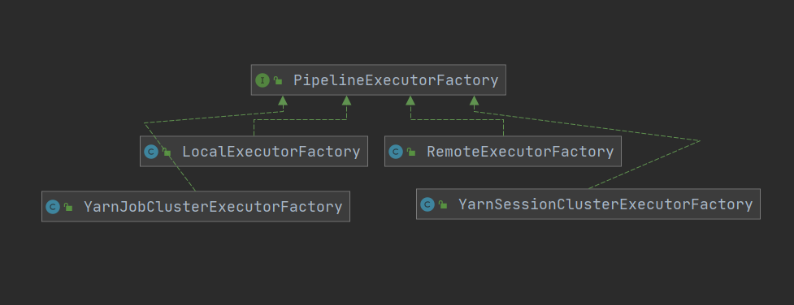
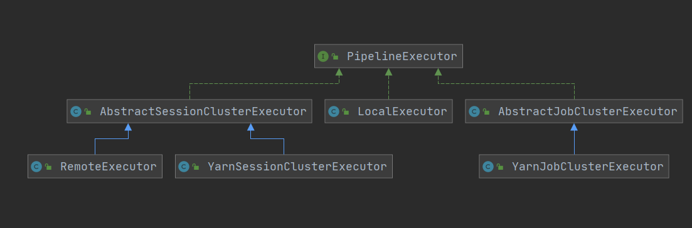
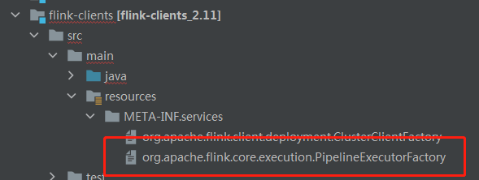
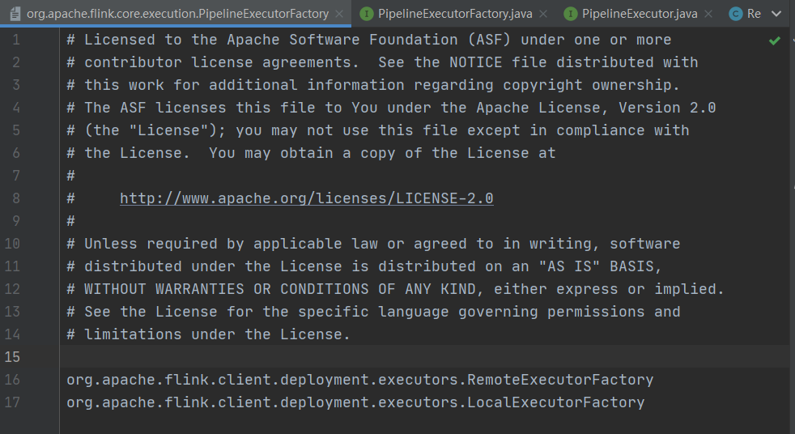

## FLINK1.10.1基于工厂模式的任务提交与SPI机制

Flink任务执行模式包含了yarn-session、standalone、per-job、local, 在1.10中又增加k8s的执行模式，那么在任务提交过程中如何根据不同的执行模式进行任务提交呢？主要通过两个接口来实现：PipelineExecutorFactory 与 PipelineExecutor。PipelineExecutorFactory用于在不同模式下创建不同的PipelineExecutor, 用于提交任务，PipelineExecutorFactory表示的一个创建执行器工厂接口，PipelineExecutor 表示一个执行器接口，正如你所想这里使用的就是经典的工厂设计模式，在任务提交过程中会根据不同的提交模式， 使用不同的PipelineExecutorFactory创建不同的PipelineExecutor。


```java
@Internal
public interface PipelineExecutorFactory {

	/**
	 * Returns the name of the executor that this factory creates.
	 */
	String getName();

	/**
	 * Returns {@code true} if this factory is compatible with the options in the
	 * provided configuration, {@code false} otherwise.
	 */
	boolean isCompatibleWith(final Configuration configuration);

	/**
	 * Instantiates an {@link PipelineExecutor} compatible with the provided configuration.
	 * @return the executor instance.
	 */
	PipelineExecutor getExecutor(final Configuration configuration);
}
```

PipelineExecutorFactory几个实现分别为：

1. LocalExecutorFactory(local)

2. RemoteExecutorFactory(standalone)

3. YarnJobClusterExecutorFactory(per-job)

4. YarnSessionClusterExecutorFactory(yarn-session)


<div align=center>
  
</div>


```java
public interface PipelineExecutor {

	CompletableFuture<? extends JobClient> execute(final Pipeline pipeline, final Configuration configuration) throws Exception;
}
```

PipelineExecutor对应实现: 

1. RemoteExecutor(standalone)

2. LocalExecutor(local)

3. YarnJobClusterExecutor(per-job) 

4. YarnSessionClusterExecutor(yarn-session)


<div align=center>
  
</div>

那么具体是如何选择factory呢？由PipelineExecutorServiceLoader接口来完成，其只有一个实现类DefaultExecutorServiceLoader， 透过命名你可能会才想到这里面用到了ServiceLoader，你的猜想是正确的，**它就是通过SPI机制去加载flink所提供的不同factory，在META-INF.services 下可以找到其对应的配置：**

<div align=center>
  
</div>

<div align=center>
  
</div>


DefaultExecutorServiceLoader.java部分源码

```java
// SPI机制
private static final ServiceLoader<PipelineExecutorFactory> defaultLoader = ServiceLoader.load(PipelineExecutorFactory.class);

@Override
	public PipelineExecutorFactory getExecutorFactory(final Configuration configuration) {
		checkNotNull(configuration);

		final List<PipelineExecutorFactory> compatibleFactories = new ArrayList<>();
		final Iterator<PipelineExecutorFactory> factories = defaultLoader.iterator();
		while (factories.hasNext()) {
			try {
				final PipelineExecutorFactory factory = factories.next();
				if (factory != null && factory.isCompatibleWith(configuration)) {
					compatibleFactories.add(factory);
				}
			} catch (Throwable e) {
				if (e.getCause() instanceof NoClassDefFoundError) {
					LOG.info("Could not load factory due to missing dependencies.");
				} else {
					throw e;
				}
			}
		}

		if (compatibleFactories.size() > 1) {
			final String configStr =
				configuration.toMap().entrySet().stream()
					.map(e -> e.getKey() + "=" + e.getValue())
					.collect(Collectors.joining("\n"));

			throw new IllegalStateException("Multiple compatible client factories found for:\n" + configStr + ".");
		}

		return compatibleFactories.isEmpty() ? null : compatibleFactories.get(0);
	}
```

**ServiceLoader.load(PipelineExecutorFactory.class) 会从类路径的META-INF.services下找到PipelineExecutorFactory的全路径文件，然后实例化出所有的factory，通过PipelineExecutorFactory.isCompatibleWith找到匹配的factory。**