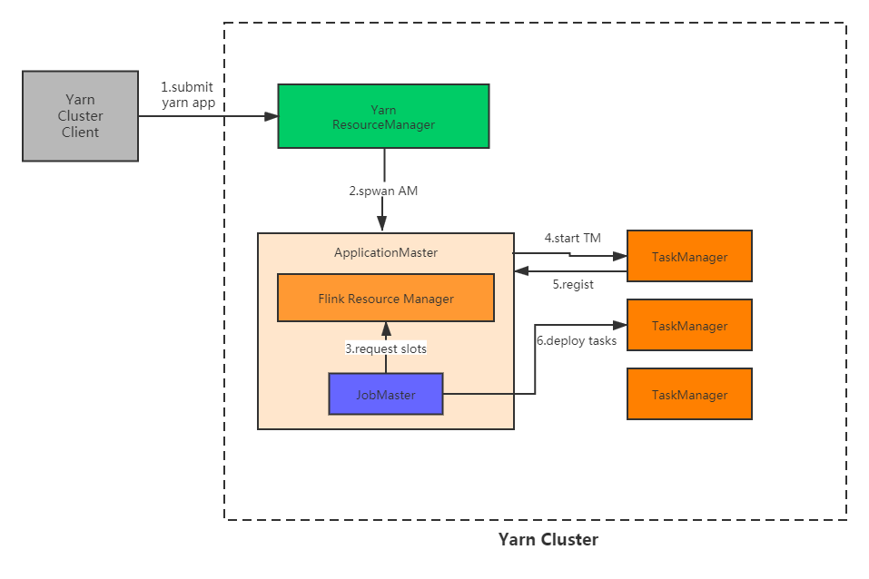
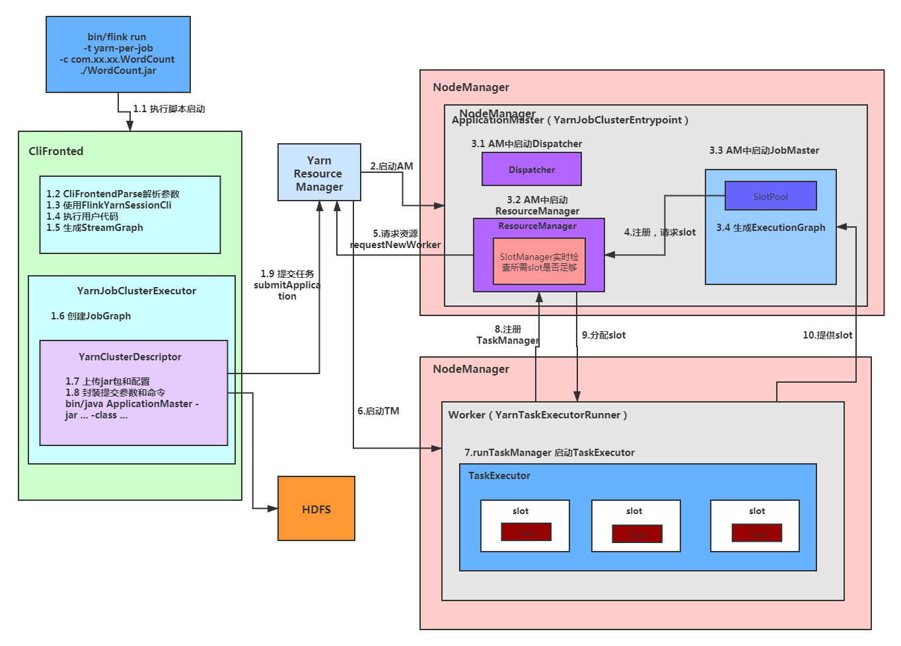

### Yarn per-job模式提交任务源码分析

**下面的源码分析基于flink1.10.1**

先看一张简单的流程图：

<div align=center>
  
</div>

简单地看，提交的流程主要有六步：

1. 通过client提交任务到yarn集群的ResourceManager
2. ResourceManager分配一个container来启动ApplicationMaster，也就是Flink的JobManager。JobManager主要有JobMaster，Dispatcher，ResourceManager等几个重要的组件
3. JobMaster向Flink的ResourceManager申请slot
4. Flink的RM会向Yarm的RM申请资源，分配container给flink，在container上启动TaskManager
5. TaskManager启动成功后会向Flink的RM注册
6. JobMaster将任务调度到分配好的TaskManager中执行任务

<div align=center>
  
</div>


下面来详细分析每一步骤的代码实现

#### 1.提交前的执行逻辑

##### 1.1 执行启动脚本

flink脚本部署时位于bin目录下，如果是源码位于flink-dist模块src/main/flink-bin/bin目录下

flink脚本主要做了以下几件事：

1. 加载config.sh
2. 构造java命令运行所需参数
3. 调用java命令执行org.apache.flink.client.cli.CliFrontend类

```shell
exec $JAVA_RUN $JVM_ARGS $FLINK_ENV_JAVA_OPTS "${log_setting[@]}" -classpath "`manglePathList "$CC_CLASSPATH:$INTERNAL_HADOOP_CLASSPATHS"`" org.apache.flink.client.cli.CliFrontend "$@"
```


##### 1.2 CliFrontendParser解析参数

```java
	protected void run(String[] args) throws Exception {
		LOG.info("Running 'run' command.");

		final Options commandOptions = CliFrontendParser.getRunCommandOptions();
		final CommandLine commandLine = getCommandLine(commandOptions, args, true);
	}
```

```java
	public CommandLine getCommandLine(final Options commandOptions, final String[] args, final boolean stopAtNonOptions) throws CliArgsException {
		final Options commandLineOptions = CliFrontendParser.mergeOptions(commandOptions, customCommandLineOptions);
		return CliFrontendParser.parse(commandLineOptions, args, stopAtNonOptions);
	}
```


##### 1.3 使用FlinkYarnSessionCli

##### CliFronted.java

```java
public static void main(final String[] args) {
	...	...
		// TODO by lwq 初始化命令行对象
		final List<CustomCommandLine> customCommandLines = loadCustomCommandLines(
			configuration,
			configurationDirectory);
	...	...
}
```

```java
	public static List<CustomCommandLine> loadCustomCommandLines(Configuration configuration, String configurationDirectory) {
		List<CustomCommandLine> customCommandLines = new ArrayList<>();
		customCommandLines.add(new ExecutorCLI(configuration));

		//	Command line interface of the YARN session, with a special initialization here
		//	to prefix all options with y/yarn.
		final String flinkYarnSessionCLI = "org.apache.flink.yarn.cli.FlinkYarnSessionCli";
		try {
			customCommandLines.add(
				loadCustomCommandLine(flinkYarnSessionCLI,
					configuration,
					configurationDirectory,
					"y",
					"yarn"));
		} catch (NoClassDefFoundError | Exception e) {
			LOG.warn("Could not load CLI class {}.", flinkYarnSessionCLI, e);
		}

		//	Tips: DefaultCLI must be added at last, because getActiveCustomCommandLine(..) will get the
		//	      active CustomCommandLine in order and DefaultCLI isActive always return true.
		// 在最后添加DefaultCLI命令行
		customCommandLines.add(new DefaultCLI(configuration));

		return customCommandLines;
	}
```

**添加了3个CustomCommandLine，按顺序分别是：ExecutorCLI，FlinkYarnSessionCli和DefaultCLI。**

**后面会按照这个顺序遍历，选出一个可以使用的CustomCommandLine。**

ExecutorCLI：当指定execution.target参数和-e参数时会优先使用

FlinkYarnSessionCli：当使用yarn模式提交时会使用，例如命令行参数中有-m yarn-cluster，yarn-session或yarn-per-job等

DefaultCLI：都没有匹配上时使用这个

获得CustomCommandLine代码如下：

**CliFronted.java**

```java
	protected void run(String[] args) throws Exception {
		...	...
		final Configuration effectiveConfiguration =
			getEffectiveConfiguration(commandLine, programOptions, jobJars);
		...	...
	}
```

```java
	private Configuration getEffectiveConfiguration(
		final CommandLine commandLine,
		final ProgramOptions programOptions,
		final List<URL> jobJars) throws FlinkException {

        ...	...
		// TODO by lwq 获取激活的命令行
		final CustomCommandLine customCommandLine = getActiveCustomCommandLine(checkNotNull(commandLine));
		...	...
	}
```

```java
public CustomCommandLine getActiveCustomCommandLine(CommandLine commandLine) {
   LOG.debug("Custom commandlines: {}", customCommandLines);
   // TODO by lwq 根据加入列表的顺序，获取激活的命令行
   for (CustomCommandLine cli : customCommandLines) {
      LOG.debug("Checking custom commandline {}, isActive: {}", cli, cli.isActive(commandLine));
      if (cli.isActive(commandLine)) {
         return cli;
      }
   }
   throw new IllegalStateException("No command-line ran.");
}
```


##### 1.4 执行用户代码

